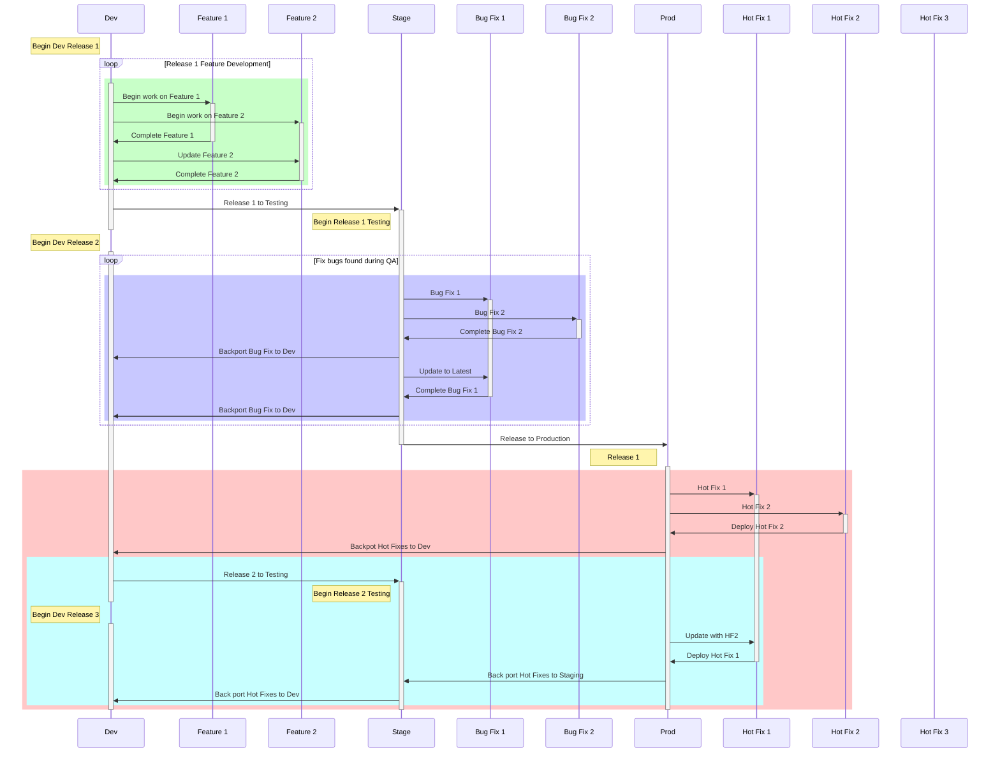

## Git Branching/Release Strategy

```mermaid
sequenceDiagram
    participant D as Dev
    participant F1 as Feature 1
    participant F2 as Feature 2
    participant S as Stage
    participant BF1 as Bug Fix 1
    participant BF2 as Bug Fix 2
    participant P as Prod
    participant HF1 as Hot Fix 1
    participant HF2 as Hot Fix 2
    participant HF3 as Hot Fix 3

    %% Begin feature work for new Release
    Note left of D: Begin Dev Release 1
    loop Release 1 Feature Development
        rect rgb(200, 255, 200)
            activate D
            D->>+F1: Begin work on Feature 1
            D->>+F2: Begin work on Feature 2
            
            F1->>-D: Complete Feature 1

            D->>F2: Update Feature 2
            F2->>-D: Complete Feature 2
        end
    end

    %% Feature work complete, release to Testing
    D->>+S: Release 1 to Testing
    Note left of S: Begin Release 1 Testing
    deactivate D
    Note left of D: Begin Dev Release 2
    activate D
    
    loop Fix bugs found during QA
        rect rgb(200, 200, 255)
            S->>+BF1: Bug Fix 1
            S->>+BF2: Bug Fix 2
            BF2->>-S: Complete Bug Fix 2
            S->>D: Backport Bug Fix to Dev
            S->>BF1: Update to Latest
            BF1->>-S: Complete Bug Fix 1
            S->>D: Backport Bug Fix to Dev
        end
    end

    %% Testing complete, release to Production
    S->>-P: Release to Production
    Note left of P: Release 1
    activate P
    rect rgb(255, 200, 200)
        P->>+HF1: Hot Fix 1
        
        P->>+HF2: Hot Fix 2
        HF2->>-P: Deploy Hot Fix 2
        P->>D: Backpot Hot Fixes to Dev

        rect rgb(200, 255, 255)
        D->>+S: Release 2 to Testing
        Note left of S: Begin Release 2 Testing
        deactivate D
        Note left of D: Begin Dev Release 3
        activate D

        P->>HF1: Update with HF2
        HF1->>-P: Deploy Hot Fix 1

        P->>S: Back port Hot Fixes to Staging
        S->>D: Back port Hot Fixes to Dev
        end
    end
    
    
    %% end of graph
    deactivate S
    deactivate D
    deactivate P
```
